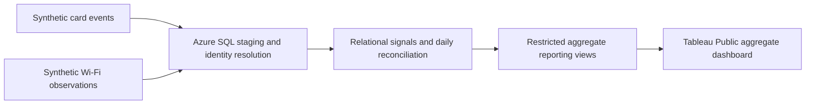
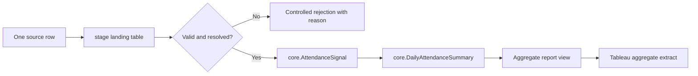

# Azure SQL Dual-Signal Office Attendance Analytics Lab

I built this lab after working on a real office-attendance reporting problem where Wi-Fi presence and card-access data each had gaps. This repository is not that production system. It is a synthetic Azure SQL version of the same kind of problem, built to practice database design, loading, permissions, recovery, and reporting.

I modeled one fictional office, generated synthetic card-access and Wi-Fi observations, loaded them through controlled SQL procedures, reconciled the two signals into daily attendance estimates, and exposed only aggregate reporting views.

The project uses no employer data, credentials, screenshots, identifiers, code, internal field names, or proprietary architecture. All people, offices, devices, access points, and events are fictional.

## What I wanted to prove

I wanted the dashboard to be the output, not the project. The main goal was to practice the database administration work around a small analytical workload:

- design a relational model with staging, core, and reporting boundaries;
- load imperfect source data without losing lineage;
- reject bad rows in a controlled way;
- prove least-privilege loader and reporter access;
- measure and keep one query improvement only after regression checks;
- configure auditing, alerting, backup, and point-in-time recovery;
- keep the published material useful without exposing private cloud details.

The result is intentionally small, but it is complete enough to show how I think about database state, permissions, recovery, and verification.

## The problem model

Badge data is useful, but it is not always complete. If three people enter together and only one person badges in, a badge-only count can understate aggregate attendance. Wi-Fi presence can fill some of that gap, but it can also miss people when a managed device is not observed.

For this lab, I created a fictional office where each person may produce:

- a card-access event;
- a managed-device Wi-Fi observation;
- both signals on the same day;
- or no attendance signal.

The database reconciles those signals into one daily classification:

| Card signal | Wi-Fi signal | Daily classification |
|---|---|---|
| Yes | No | `CARD` |
| No | Yes | `WIFI` |
| Yes | Yes | `BOTH` |
| No | No | No attendance row |

The result is an aggregate estimate. It is not proof of an individual's location and is not suitable for payroll, discipline, performance management, or access-control decisions.

## Architecture



The detailed schema, object responsibilities, and trade-offs are in [Architecture](docs/architecture.md) and [Schema Design](docs/schema-design.md).

## A source row path I actually use

When I want to check whether the system is behaving correctly, I do not start with Tableau. I follow one source row through the database.

A fictional card-access row first lands in `stage.CardAccessEventStage` as source-shaped input. The load procedure checks the batch, source checksum, row number, timestamp, card reader, and fictional person reference. If the row is valid, SQL creates a normalized `core.AttendanceSignal` row with source lineage back to the batch and source row. If the row is invalid, it stays visible as a controlled rejection instead of being silently dropped or mixed into the core model.

The Wi-Fi side follows the same pattern through `stage.WifiObservationStage`. The device observation has to resolve through the date-bounded fictional device assignment before it can become a `core.AttendanceSignal`.

After the monthly card and Wi-Fi batches finish, the daily-summary procedure rebuilds `core.DailyAttendanceSummary`. That is where one person-day becomes `CARD`, `WIFI`, or `BOTH`. Tableau never reads that person-day table directly. It reads only aggregate `report` views, such as daily office totals and department-level counts.



That row path is the project in miniature: land the source data, validate it, preserve lineage, reject bad input deliberately, derive the summary, and publish only the aggregate reporting shape.

## Three decisions that mattered

### Azure SQL instead of a warehouse or lake

I chose Azure SQL because the point of the lab was database administration: schemas, constraints, stored procedures, permissions, monitoring, auditing, recovery, and query tuning.

A warehouse or lake would be a reasonable choice for a broader analytics platform. For this project, it would have moved attention away from the DBA skills I wanted to demonstrate.

### Staging, core, and report boundaries in one database

I kept the workload inside one Azure SQL Database, but I still separated the responsibilities.

The `stage` schema receives source-shaped card and Wi-Fi rows. The `core` schema holds constrained reference data, assignments, normalized attendance signals, and the reproducible daily summary. The `report` schema exposes only aggregate views for analysis.

That split let me practice the same boundary thinking I would use in a larger system without adding extra Azure services just to make the architecture look bigger.

### Aggregate extracts for Tableau

I did not publish a live Azure SQL connection or a workbook with private connection metadata.

The Tableau workbook is built from deterministic aggregate extracts produced from the same reporting checks used by the repository. The database proves the reporting contract first; Tableau is the public view of those aggregates.

The companion dashboard is published on Tableau Public:

[Azure SQL Office Attendance Analytics Lab](https://public.tableau.com/app/profile/guilherme.canh.o/viz/azure-sql-office-attendance-lab-tableau-public/AttendanceOverview)

## What I built

The repository contains the implementation:

- ordered SQL deployment scripts;
- a deterministic synthetic-data generator;
- controlled reference and monthly source loaders;
- validation and rejection handling;
- daily summary refresh logic;
- least-privilege role definitions and permission tests;
- aggregate reporting views;
- performance benchmark tooling and retained-index measurement;
- monitoring, auditing, and recovery verification tooling;
- Tableau aggregate-export and artifact-inspection tooling.

The generated full dataset and workbook binaries are not committed. The repository keeps source, tests, a small sample dataset, and a concise public verification summary.

## What passed

The completed lab reconciled:

- 12 months of deterministic synthetic data;
- 24 monthly source files;
- 134,372 received rows;
- 133,892 accepted rows;
- 480 controlled rejected rows;
- 37,151 aggregate person-days;
- 1,236 `CARD`-only person-days;
- 11,082 `WIFI`-only person-days;
- 24,833 `BOTH` person-days;
- zero failed, open, or unreconciled batches after the canonical load;
- 13 of 13 schema behavior checks;
- 77 offline loader, reporting, monitoring, recovery, Tableau, and identity tests.

This README is the case study. The public verification summary is in [docs/verification-summary.md](docs/verification-summary.md).

To run the offline Python checks from the repository root:

```bash
python3 scripts/run_offline_tests.py
```

## How I troubleshoot this kind of system

I try to separate layers before changing anything.

For this lab, that meant distinguishing Azure control-plane state from SQL data-plane readiness, firewall access from authentication, authentication from database permissions, and successful Tableau sign-in from a safe reporting boundary.

One repeated example was Azure SQL serverless resume. Azure Resource Manager could report the database as `Online` before the target database was ready for a data-plane query. A successful harmless query against `master` proved the logical server, authentication, and firewall path were healthy; the remaining issue was target-database readiness, not a reason to weaken the firewall.

The detailed troubleshooting notes are in [Troubleshooting](docs/troubleshooting.md).

## What I would improve now

If I continued the lab, I would prioritize:

1. Add infrastructure-as-code after the portal-first learning pass, so the Azure foundation can be rebuilt more cleanly.
2. Add CI for the offline test suite, public sample verifier, and Markdown link checks.
3. Build a more production-like loader identity path, preferably with managed identity where the runtime supports it.
4. Add a small automated check for the published Tableau metadata, so the public dashboard link is verified alongside the repository checks.

## What I deliberately left out

I kept the scope narrow so the database administration work stayed visible.

| Feature | Why I left it out |
|---|---|
| Azure Data Factory, Fabric, Synapse, or Functions | They would shift the center of the project away from Azure SQL administration |
| A live public database endpoint | The repository is the public artifact; the database is not exposed |
| Person-level reporting | The public story is aggregate attendance, not individual presence |
| Real office data | The lab is designed to be reproducible and safe to publish |
| Long-term backup retention | Point-in-time recovery was enough for the recovery objective being tested |
| Terraform state, BACPACs, or database backups | They can contain account or environment metadata that does not belong in a public repo |
| Tableau workbook binaries | The workbook package is not needed to prove the Azure SQL design and can carry metadata risk |

## Repository map

```text
docs/        Technical appendices, verification summary, recovery, and troubleshooting notes
sql/         Ordered deployment, validation, security, and cleanup scripts
generator/   Synthetic-data generator and public sample tools
loader/      Guarded loading client and post-load verifier
reporting/   Independent aggregate-report checks
tableau/     Aggregate exporter and Tableau artifact verifier
performance/ Reporting benchmark and index experiment tooling
tests/       SQL behavior tests and shared public test helpers
scripts/     Local convenience commands for reproducible checks
```

## Copyright

Copyright © 2026 Guilherme Canhao. All rights reserved.

No license is granted to use, reproduce, modify, distribute, or create derivative works from this material beyond the permissions required by GitHub's Terms of Service or otherwise provided by applicable law.
