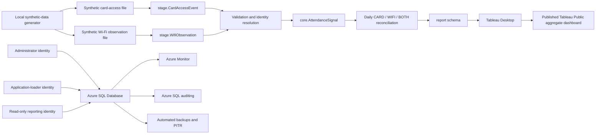

# Architecture

## Version 1

## Responsibilities

| Layer | Responsibility |
|---|---|
| Generator | Create deterministic fictional card and Wi-Fi records plus controlled invalid cases |
| `stage` | Receive the two untrusted source formats without presenting them as validated facts |
| Load procedure | Validate, resolve identities, reject, deduplicate, and commit each batch transactionally |
| `core` | Hold constrained people, devices, assignments, access points, and authoritative normalized signals |
| `report` | Expose privacy-safe views and procedures for analytical consumers |
| Tableau | Visualize only the aggregate reporting interface |

## Initial relational model

| Entity | Purpose |
|---|---|
| Office | One fictional office in the initial dataset; schema supports future offices |
| Person | Synthetic personnel identifier and fictional attributes |
| Device | Synthetic opaque device token with no real hardware identifier |
| PersonDeviceAssignment | Date-bounded relationship between a fictional person and device |
| AccessPoint | Fictional card reader or Wi-Fi observation origin |
| ImportBatch | Load lineage, status, counts, checksum, and error information |
| CardAccessEventStage | Landing area for untrusted synthetic card events |
| WifiObservationStage | Landing area for untrusted synthetic Wi-Fi observations |
| AttendanceSignal | Authoritative normalized `CARD` or `WIFI` signal |
| DailyAttendanceSummary | Reproducible `CARD`, `WIFI`, or `BOTH` daily result |

`AttendanceSignal` is the authoritative normalized fact. `DailyAttendanceSummary` must be reproducible through a controlled procedure and will not be treated as an independent source of truth.

## Reconciliation rule

| Card signal | Wi-Fi signal | Daily classification |
|---|---|---|
| Yes | No | `CARD` |
| No | Yes | `WIFI` |
| Yes | Yes | `BOTH` |
| No | No | No daily attendance row |

## Security model

- Administrator: deploy and administer database objects.
- Application loader: execute controlled load operations and access only required staging objects.
- Reporter: select only from aggregate `report` views and execute controlled reporting procedures.
- Direct reporter access to `stage` and sensitive `core` objects is denied by omission and verified with negative tests.
- Dynamic data masking may be demonstrated, but it is not treated as a substitute for permissions and restricted views.

## Trade-offs

One Azure SQL Database intentionally combines landing, relational, reconciliation, and reporting responsibilities. This keeps the lab affordable and makes database administration the focus. The initial dataset contains one office, so cross-office comparison is deliberately absent; the normalized `Office` relationship prevents that current scope from being hard-coded. A larger production design might separate raw object storage, orchestration, curated storage, and semantic reporting, but those services are outside version 1.

Wi-Fi presence is a device-based proxy rather than definitive proof that a person is present. The lab uses it to improve aggregate occupancy estimates, not for payroll, disciplinary, or individual-performance decisions.
