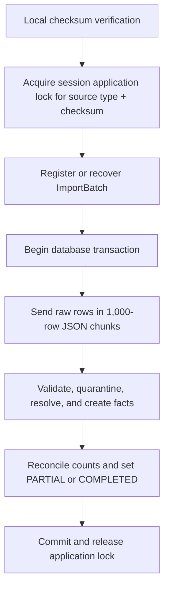

# Controlled Staging-Load Contract

## Purpose

This contract defines how the verified local synthetic dataset enters Azure SQL, how each row is validated, how failures and reruns behave, and what must pass before the loading work is treated as complete.

## Implementation status

The Python client, shared safety helpers, independent loaded-data verifier, and offline tests are implemented. Local compilation, five offline safety tests, the complete 24-file dry-run, and the Entra-token data-plane probe pass. The first canonical load and full summary refresh completed successfully, and a fresh verifier connection matched every independent expected result. An unchanged rerun returned reference `UNCHANGED`, all 24 batches `ALREADY_PROCESSED`, and identical fresh-verifier totals. This contract is satisfied and the loading milestone is complete.

Runtime target values are supplied only through `ATTENDANCE_SQL_SERVER` and `ATTENDANCE_SQL_DATABASE`. The client does not read `.env` files or print those values. Azure CLI output and ODBC exceptions are captured and reduced to privacy-safe categories before any console output.

## Decision summary

| Area | Decision |
|---|---|
| Transport | A local Python client using Microsoft ODBC Driver 18 and `pyodbc` |
| Authentication | Short-lived Microsoft Entra token obtained from the existing Azure CLI session |
| Secrets | No SQL password, token, connection string, or server name committed or printed |
| Reference input | Small JSON payload sent to one controlled bootstrap procedure |
| Monthly source input | CSV rows sent as JSON chunks of 1,000 rows to controlled staging procedures |
| Database authority | T-SQL procedures own validation, identity resolution, fact creation, batch counts, and status changes |
| Atomic unit | One monthly source file |
| Duplicate rule | Source type plus SHA-256 checksum; completed duplicates are successful no-ops |
| Expected terminal status | `PARTIAL` for batches containing controlled rejected rows; `COMPLETED` only when all rows are accepted |
| Summary refresh | Rebuild once after all 24 source batches reach a terminal state |
| Verification | A separate Python verifier compares Azure SQL results with the local expected files and manifest |

## Why this transport is appropriate

The Azure portal query editor is useful for administrative SQL but is not a credible bulk-loading interface for 134,372 rows. A server-side `BULK INSERT` would require the files to be placed in reachable cloud storage. Adding Blob Storage, credentials, and lifecycle controls only to move this small personal-lab dataset would expand cost and attack surface without strengthening the database-administration objective.

The local client therefore transports data over the existing encrypted Azure SQL connection. It does not decide which rows are valid. Validation and transformation remain in versioned T-SQL so behavior is testable, reviewable, and later grantable through least-privilege `EXECUTE` permissions.

## Preflight gates

The loader must stop before connecting to Azure SQL unless all of the following pass:

1. `verify_output.py` returns checksum and contract verification `PASS`.
2. The local manifest version, generator version, seed, and expected file inventory are present.
3. Every input file matches its recorded SHA-256 and row count.
4. The source volume remains within the configured guardrail.
5. The server and database are supplied at runtime, not read from a committed file.
6. An Azure SQL access token is acquired without displaying or persisting it.

The implemented default dry-run evaluates gates 1–5 without invoking Azure CLI. Probe and load modes then evaluate token acquisition and the data-plane gate. A target-database readiness failure triggers a harmless `master` probe only to separate logical-server reachability from serverless database readiness; it does not alter network or database configuration.

## Reference-data bootstrap

Reference data is loaded before source batches in this dependency order:

1. Office
2. Department
3. Person
4. Device
5. Person-device assignment
6. Access point

The client converts the already verified reference CSV files into one JSON payload. A controlled procedure validates the complete payload and applies it in one transaction.

Rerun behavior is strict:

- an absent natural key is inserted;
- an existing natural key with identical contracted values is retained;
- an existing natural key with conflicting values causes the entire reference transaction to fail; and
- no existing reference row is silently overwritten.

Historical device assignments are loaded through this bootstrap procedure because the final device state can already be `RETIRED`. The operational `core.usp_AssignDevice` procedure remains the interface for later individual assignment changes.

## Monthly batch lifecycle

Each of the 24 monthly source files is an independent atomic unit.



The source filename stored in Azure SQL is the basename only. A local workstation path must never be written to the database.

### Duplicate and retry behavior

- A terminal batch with the same source type and checksum returns `ALREADY_PROCESSED`; no rows or counts change.
- A same-named file with different content is a new batch because identity is content-based rather than filename-based.
- A failed transaction rolls back staged rows, errors, facts, and count changes together.
- After rollback, the client marks the registered batch `FAILED` using the safe error category, not a token, connection string, local path, or raw exception containing private identifiers.
- If a client disappears while a batch remains `STARTED`, a later client must first acquire the same session application lock. Successful acquisition proves no active loader owns that batch, allowing controlled recovery.
- Retry of `FAILED` or abandoned `STARTED` state must clear only rows belonging to that batch before returning it to `STARTED`.

## Staging rules

Raw values remain text in `stage.CardAccessEvent` and `stage.WifiObservation`. An invalid timestamp or signal strength must land successfully and then be rejected by database validation rather than disappearing during client-side conversion.

Every source row must finish in exactly one state:

- `ACCEPTED`: one corresponding `core.AttendanceSignal` exists;
- `REJECTED`: one precedence-selected `stage.ImportError` exists; or
- `PENDING`: allowed only inside an active uncommitted batch transaction.

At terminal status:

```text
RowsReceived = RowsAccepted + RowsRejected
PENDING rows = 0
Accepted stage rows = attendance facts for the batch
Rejected stage rows = import errors for the batch
```

## Validation precedence

One source row produces at most one primary validation error. Precedence makes rejection counts deterministic when a row could violate more than one rule.

### Card rows

1. `INVALID_TIMESTAMP`
2. `BLANK_PERSONNEL_CODE`
3. `UNKNOWN_PERSONNEL`
4. `UNKNOWN_ACCESS_POINT` — missing, inactive, or not a card reader
5. `PERSON_OUTSIDE_VALIDITY`

### Wi-Fi rows

1. `INVALID_TIMESTAMP`
2. `UNKNOWN_DEVICE`
3. `UNKNOWN_ACCESS_POINT` — missing, inactive, or not a Wi-Fi access point
4. `INVALID_SIGNAL_STRENGTH`
5. `DEVICE_NOT_ASSIGNED`
6. `PERSON_OUTSIDE_VALIDITY`

The approved dataset intentionally exercises the first four codes in each list. The additional validity codes are defensive controls and should return zero for contract version 1.

## Accepted-row transformation

For accepted rows, Azure SQL—not the client—must:

- convert the ISO 8601 raw observation to `datetime2(3)` UTC;
- resolve the fictional office and access point;
- resolve card personnel by natural code;
- resolve Wi-Fi personnel through the half-open device-assignment interval;
- attach the resolved device only to Wi-Fi signals;
- derive `AttendanceDateLocal` from UTC using the office's `GMT Standard Time`; and
- preserve `(ImportBatchId, SourceRowNumber)` as authoritative source lineage.

The unique lineage constraint provides the final protection against duplicate fact creation.

## Daily-summary refresh

After all batches are terminal, one procedure rebuilds `core.DailyAttendanceSummary` from `core.AttendanceSignal` in a transaction. It must not read the local expected-results file.

Classification remains:

| Card count | Wi-Fi count | Detection method |
|---:|---:|---|
| Greater than zero | 0 | `CARD` |
| 0 | Greater than zero | `WIFI` |
| Greater than zero | Greater than zero | `BOTH` |

For contract version 1, the verified result should contain no valid `CARD`-only day.

## Required implementation artifacts

- `sql/007_create_reference_loader.sql`
- `sql/008_create_batch_loader.sql`
- `sql/009_create_daily_summary_refresh.sql`
- `loader/load_data.py`
- `loader/verify_loaded_data.py`
- catalog and rollback-protected behavior tests for each procedure
- a sanitized public summary containing counts and statuses but no endpoint, token, account identifier, IP address, or local absolute path

## Acceptance summary

The independent post-load verifier must compare Azure SQL with the local manifest and expected files and obtain:

| Measure | Required value |
|---|---:|
| Offices | 1 |
| Departments | 8 |
| People | 300 |
| Devices | 315 |
| Device assignments | 315 |
| Access points | 5 |
| Import batches | 24 |
| Source rows | 134,372 |
| Accepted rows / attendance signals | 133,892 |
| Rejected rows / import errors | 480 |
| Daily person records | 37,151 |
| `BOTH` days | 24,833 |
| `WIFI` days | 11,082 |
| `CARD` days | 1,236 |
| Pending source rows | 0 |

Additional required tests:

1. All 24 database batch results match `expected_batch_results.csv` by source type and filename.
2. All database validation counts match `expected_validation_counts.csv`.
3. Every database daily row matches `expected_daily_attendance.csv`.
4. A second unchanged full load reports all batches already processed and changes no counts.
5. A controlled mid-batch failure leaves no partial stage, error, or fact rows and can be safely retried.
6. Reference-data rerun is a no-op, while a conflicting natural-key payload fails atomically.

## Cost and security boundary

This design creates no additional Azure service. It reuses the existing selected-network endpoint, TLS 1.2 requirement, Microsoft Entra administration path, and free-offer database. Broad Azure-service access remains disabled.

The administrative loader proves correctness. The security boundary adds the final application-loader identity and demonstrate that it can execute only the approved load interfaces while being denied direct core-table modification and reporting access.

## Implementation references

- [Install Microsoft ODBC Driver 18 for SQL Server on macOS](https://learn.microsoft.com/en-us/sql/connect/odbc/linux-mac/install-microsoft-odbc-driver-sql-server-macos)
- [Use Microsoft Entra ID with the ODBC Driver](https://learn.microsoft.com/en-us/sql/connect/odbc/using-azure-active-directory)
